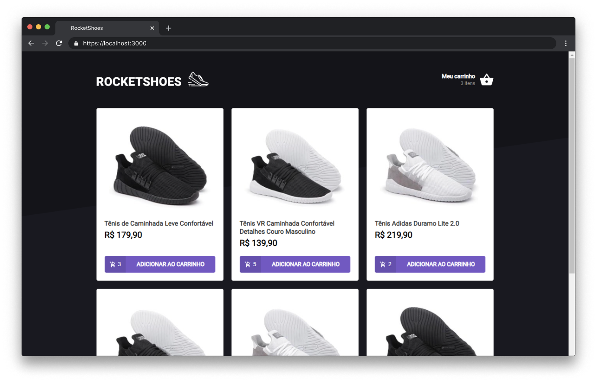

<h1 align="center">
  
</h1>

<p align="center">
  <a href="#-tecnologias">Tecnologias</a>&nbsp;&nbsp;&nbsp;|&nbsp;&nbsp;&nbsp;
  <a href="#-uso">Uso</a>&nbsp;&nbsp;&nbsp;|&nbsp;&nbsp;&nbsp;
  <a href="#-projeto">Projeto</a>&nbsp;&nbsp;&nbsp;|&nbsp;&nbsp;&nbsp;
  <a href="#-licença">Licença</a>
</p>

<p align="center">
  

  
</p>

<br>

<p align="center">
  
</p>

## 🧪 Tecnologias

Esse projeto foi desenvolvido com as seguintes tecnologias:

- TypeScript
- ReactJS
- Styled Components
- JSON Server

## 🚀 Uso

```bash 
git clone https://github.com/gutemberg-jhonata/rocketshoes.git
cd rocketshoes
yarn server
yarn start
```

## 💻 Projeto

O RocketShoes foi um desafio realizado durante o bootcamp Ignite, na trilha de ReactJS. Trata-se de um e-commerce para venda de calçados.

## :memo: Licença

Esse projeto está sob a licença MIT. Veja o arquivo [LICENSE](.github/LICENSE.md) para mais detalhes.